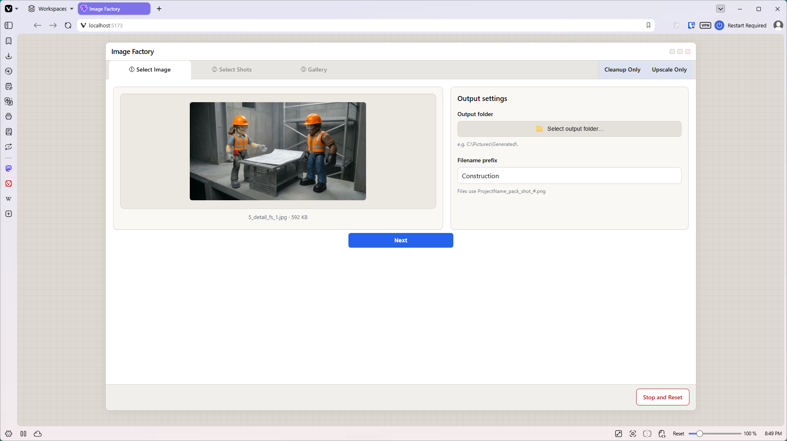
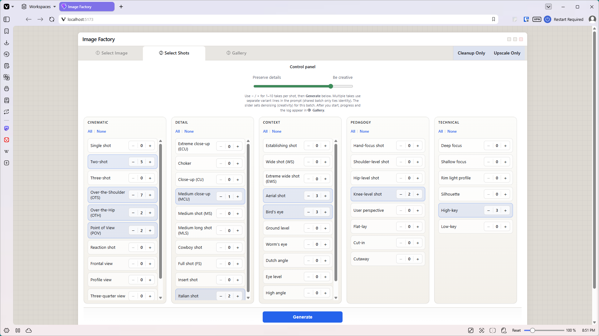
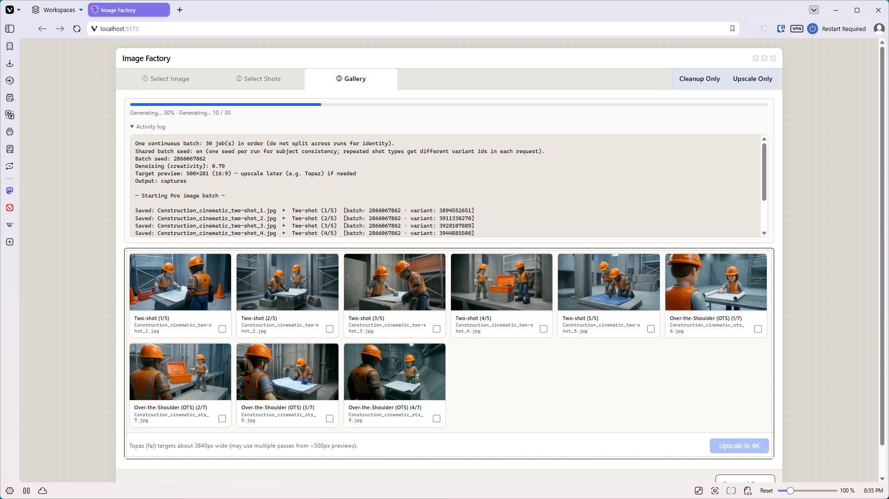

# ShotSmith — Setup guide (step by step)

This guide is for **first-time setup** if you are new to Node.js, the command line, or “local dev” apps. It walks through every step in order.

**Already comfortable with those tools?** Use the shorter [Quick start in USER_GUIDE.md](USER_GUIDE.md#quick-start) instead.

**Screenshots:** The [workflow walkthrough](#part-7-confirm-setup-works) below includes UI examples from the docs ([`docs/images/`](docs/images/)). Some show an earlier development title; current builds display **ShotSmith**.

---

## What you are installing

ShotSmith is **not** a website you log into. It is a **program that runs on your computer**:

1. A small **server** starts in a terminal window (using **Node.js**).
2. You open the app in **Chrome** or **Edge** at an address like `http://localhost:5173/`.
3. The app calls **Google Gemini** (and optionally **fal.ai**) using **your** API keys.
4. Generated images save to a **folder you pick** on your hard drive.

Nothing is hosted for you in the cloud—you run it locally.

---

## Glossary (plain English)

| Term | What it means for ShotSmith |
|------|-----------------------------|
| **Node.js** | Free software that lets JavaScript apps run on your computer (not just in a browser). You install it once. |
| **npm** | A tool that ships with Node.js. It downloads the libraries ShotSmith needs (`npm install`) and runs commands like `npm run dev`. |
| **Terminal** | A text window where you type commands. On Windows: **PowerShell** or **Command Prompt**. On Mac: **Terminal**. |
| **Project folder** | The folder that contains `package.json`—your copy of ShotSmith. |
| **Dev server** | The local server started by `npm run dev`. It must stay running while you use the app. |
| **`localhost`** | “This computer.” `http://localhost:5173/` means “the app running on my machine, port 5173.” |
| **API key** | A password-like string from Google (and optionally fal.ai) that lets the app call their AI services. **You** create it; **you** pay for usage. |
| **`_local/.env`** | A private text file on your PC where your API keys live. It is **never** uploaded to GitHub. |

---

## Before you start

| You need | Notes |
|----------|--------|
| A computer with admin rights to install software | Windows, macOS, or Linux |
| **Node.js** LTS | [nodejs.org](https://nodejs.org) — install if you do not have it yet ([Part 2](#part-2-install-nodejs)) |
| **Chrome** or **Edge** | Recommended for the output-folder picker |
| A **Google account** | For a Gemini API key ([Part 4](#part-4-get-a-google-gemini-api-key)) |
| Internet | For API calls and the first `npm install` |

Optional later: a **fal.ai** account if you want Solo Upscale / 4K upscale ([Part 8](#part-8-optional-falai-for-upscale)).

---

## Part 1: Get ShotSmith onto your computer

### Option A — Download ZIP (easiest if you do not use Git)

1. Open the repo: [github.com/sharonhuston/ShotSmith](https://github.com/sharonhuston/ShotSmith)
2. Click the green **Code** button → **Download ZIP**.
3. Unzip to a folder you will keep—e.g. `Documents\ShotSmith` or `Documents\apps\ShotSmith`.
4. Open that folder. You should see **`package.json`**, **`Launch ShotSmith.bat`** (Windows), and a **`_local`** folder.

**Tip:** Avoid paths with odd permissions if you can. A normal folder under Documents is fine.

### Option B — Git clone (if you use Git)

```bash
git clone https://github.com/sharonhuston/ShotSmith.git
cd ShotSmith
```

You now have the **project folder**. All following steps assume you are **inside** that folder (where `package.json` lives).

---

## Part 2: Install Node.js

Skip this part if you already have Node.js installed.

### Windows

1. Go to [https://nodejs.org](https://nodejs.org)
2. Download the **LTS** installer (recommended).
3. Run the installer—accept defaults (including “Add to PATH” if offered).
4. **Close and reopen** any terminal windows you had open.
5. Verify:
   - Press **Win + R**, type `powershell`, Enter.
   - Type:

     ```powershell
     node --version
     npm --version
     ```

   - You should see version numbers (e.g. `v22.x.x` and `10.x.x`), not “not recognized.”

### macOS

1. Download the **LTS** installer from [nodejs.org](https://nodejs.org), **or** install via Homebrew: `brew install node`
2. Open **Terminal** and run `node --version` and `npm --version`.

### Linux

Use your package manager or [nodejs.org](https://nodejs.org) instructions for your distro, then verify with `node --version` and `npm --version`.

---

## Part 3: Install ShotSmith’s dependencies (`npm install`)

This downloads the libraries listed in `package.json` into a **`node_modules`** folder (created automatically; you do not edit it).

### Windows (PowerShell)

1. Open File Explorer and go to your **project folder** (where `package.json` is).
2. Click the address bar, type `powershell`, press Enter—a PowerShell window opens **in that folder**.
3. Run:

   ```powershell
   npm install
   ```

4. Wait until it finishes (first time may take one to three minutes). No red “ERR!” at the end means success.

### macOS / Linux (Terminal)

```bash
cd /path/to/your/ShotSmith
npm install
```

**What if it fails?** Check internet connection, try again, or see [Common problems](#common-problems).

---

## Part 4: Get a Google Gemini API key

ShotSmith needs this for upload/vibe, batch generation, and cleanup.

1. Open [Google AI Studio — API keys](https://aistudio.google.com/apikey).
2. Sign in with your Google account.
3. Create an API key (follow Google’s prompts—often tied to a Google Cloud project).
4. **Copy the key** and store it somewhere safe temporarily (password manager or a local note—not an email to yourself if you can avoid it).

**If you later see 403 / “API not enabled”:**

1. Open [Google Cloud Console — Generative Language API](https://console.cloud.google.com/apis/library/generativelanguage.googleapis.com).
2. Select the project tied to your key.
3. Click **Enable**, wait a few minutes, try again.

Billing: Google may require a billing account for some models; check Google’s current terms for your key.

---

## Part 5: Create `_local/.env` (your private keys file)

Your keys go in **`_local/.env`**—not in the project root, not in GitHub.

### Step-by-step

1. In the project folder, open the **`_local`** subfolder.
2. Find **`.env.example`** (a template with `#` comment lines).
3. **Copy** that file and **paste** in the same folder.
4. **Rename** the copy to **`.env`** (exactly—starts with a dot, no `.example`).
5. Open **`.env`** in a plain text editor:
   - Windows: **Notepad** (not Word)
   - Mac: TextEdit → Format → **Make Plain Text**
6. Find this line:

   ```env
   # VITE_GEMINI_API_KEY=your_google_ai_studio_key_here
   ```

7. **Uncomment** it:
   - Delete the `#` at the start of the line.
   - Replace `your_google_ai_studio_key_here` with your real key (no quotes needed).

   It should look like:

   ```env
   VITE_GEMINI_API_KEY=AIzaSy...your_actual_key...
   ```

8. **Save** the file.

**Lines starting with `#` are comments**—the app ignores them. Only uncommented lines count.

See also [_local/.env.example](_local/.env.example) and [_local/README.md](_local/README.md).

---

## Part 6: Start ShotSmith

The app reads `_local/.env` **only when the server starts**. If you change keys later, you must stop and start again ([Part 9](#part-9-when-you-are-done-for-the-day)).

### Windows (recommended)

1. In the project folder, double-click **`Launch ShotSmith.bat`**.
2. A black terminal window opens and stays open—that is normal.
3. The first time, it may create **`_local/Launch ShotSmith.lnk`** (a shortcut with the custom icon).
4. Your browser should open to something like **`http://localhost:5173/`**.

**Next times:** you can use **`_local/Launch ShotSmith.lnk`** or the `.bat`—same thing.

### macOS / Linux

1. Open Terminal in the project folder.
2. Run:

   ```bash
   npm run dev
   ```

3. Read the URL printed in the terminal (usually `http://localhost:5173/`) and open it in Chrome or Edge.

### What you should see

- Terminal shows Vite / “ready” and a local URL.
- Browser shows the **ShotSmith** UI with tabs like **Select Image**.

**Leave the terminal window open** while you work. Closing it stops the app.

---

## Part 7: Confirm setup works

Quick smoke test:

1. **Select Image** — upload a PNG or JPEG.
2. Wait a few seconds — a **style anchor** (read-only text) should appear. That means Gemini and your API key work.
3. Choose an output folder, pick a shot on **Select Shots**, run **Generate** if you want a full test.

If the style anchor appears, setup is complete. Day-to-day use: [USER_GUIDE.md — Using the app](USER_GUIDE.md#using-the-app).

### What the app looks like (example project)

These screenshots use a sample “Construction” project. Your reference image and filenames will differ.

**Select Image** — upload, output folder, and filename prefix:



**Select Shots** — pick shot types and counts, then **Generate**:



**Gallery** — batch progress and thumbnails; select favorites to upscale:



If setup works, you should reach **Select Image** and see a style anchor after upload. The gallery appears after you run **Generate**.

---

## Part 8: Optional — fal.ai for upscale

Only needed for **Solo Upscale** or **Upscale to 4K** in the gallery.

1. Create an account at [fal.ai](https://fal.ai) and get a key from [fal.ai dashboard — keys](https://fal.ai/dashboard/keys).
2. In **`_local/.env`**, uncomment and fill in:

   ```env
   FAL_API_KEY=your_fal_key_here
   ```

3. Save, then **stop and restart** the dev server (`Ctrl+C` in the terminal, then launch again).

---

## Part 9: When you are done for the day

1. Click the **terminal** window where ShotSmith is running.
2. Press **`Ctrl+C`** (Mac: **`Ctrl+C`** or **`Cmd+.`** depending on terminal).
3. Wait until the prompt returns or the window says the process ended.

You can close the browser tab anytime. Start again tomorrow with **`Launch ShotSmith.bat`** or `npm run dev`.

---

## Optional: Windows shortcut with custom icon

The repo includes **`ShotSmith.ico`** and **`Launch ShotSmith.bat`**, but not your personal **`_local/Launch ShotSmith.lnk`** (that file is machine-specific).

- **First run of `Launch ShotSmith.bat`** creates the shortcut automatically if it is missing.
- Or run **`Create Launcher Shortcut.bat`** once to create only the shortcut.

Details: [USER_GUIDE — Windows launcher](USER_GUIDE.md#windows-create-the-launcher-shortcut-one-time).

---

## Common problems

| What you see | What to try |
|--------------|-------------|
| `'node' is not recognized` / `'npm' is not recognized` | Install Node.js ([Part 2](#part-2-install-nodejs)). Close and reopen the terminal. |
| `Missing VITE_GEMINI_API_KEY` | Create `_local/.env` from `.env.example`, uncomment the key line, save, **restart** the server. |
| Key is in `.env` but still missing | File must be **`_local/.env`**, not root `.env`. Restart server after edits. |
| 403 / API disabled | Enable Generative Language API ([Part 4](#part-4-get-a-google-gemini-api-key)). |
| Blank page or “can’t connect” | Is the terminal still running? Use the exact URL from the terminal (port may be 5174 if 5173 is busy). |
| Folder picker does not work | Use **Chrome** or **Edge**, not Firefox. |
| Changed `.env` but nothing changed | Stop server (`Ctrl+C`), start again. Env is read at startup only. |
| `npm install` errors | Check internet; delete `node_modules` and run `npm install` again. |
| Shortcut missing after download | Normal. Run **`Launch ShotSmith.bat`** once. |

More: [USER_GUIDE — Troubleshooting](USER_GUIDE.md#troubleshooting) and [README — Troubleshooting](README.md#troubleshooting).

---

## What to read next

| Doc | When to use it |
|-----|----------------|
| [USER_GUIDE.md](USER_GUIDE.md) | Daily workflow, personalization checklist, Windows launcher |
| [README.md](README.md) | Technical reference, env variables, project layout |
| [_local/README.md](_local/README.md) | What belongs in your private `_local/` folder |
| [decisions.md](decisions.md) | Why the app is built this way |

---

## Quick reference (after first setup)

```text
1. Open project folder
2. Double-click Launch ShotSmith.bat   (Windows)
   — or — npm run dev                  (Mac/Linux)
3. Browser → http://localhost:5173/
4. When finished → Ctrl+C in terminal
```

Keys live in **`_local/.env`** only. Never commit that file to GitHub.
